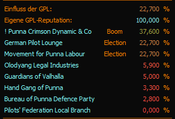
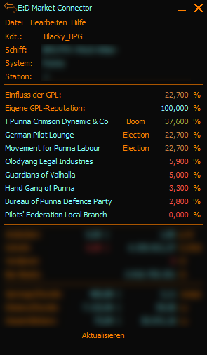
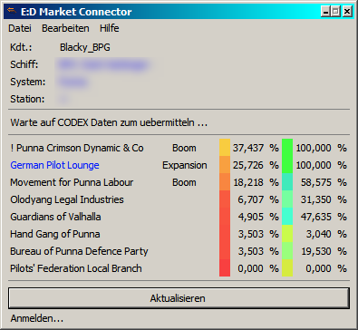
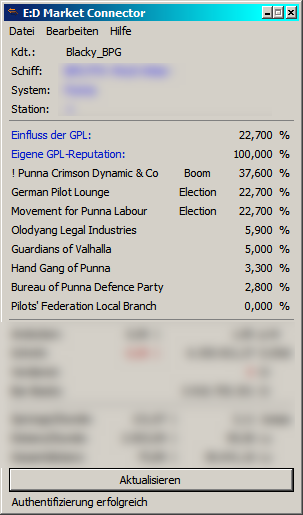
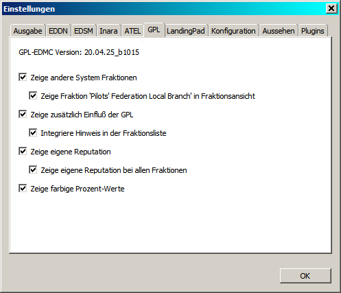

# GPL EDMC Plugin

Das ist ein einfaches Plugin für den [ED MarketConnector](https://github.com/Marginal/EDMarketConnector/wiki) welches ursprünglich einzig dem Zwecke diente den Einfluß der "German Pilot Lounge" sowie der eigenen Reputation (Ruf) bei dieser Fraktion anzuzeigen. Mittlwerweile habe ich dieses Plugin jedoch ein wenig erweitert ...





  


## Installation

So wie auch alle anderen EDMC-Plugins wird der Ordner aus dem heruntergeladenen Archiv in den Plugin-Ordner eures EDMC's entpackt, das sollte danach dann in etwa so aussehen:
```
$AppPath$\EDMarketConnector\plugins\GPL
```
Nach dem starten des EDMC ist das Plugin sofort einsatzbereit, es ist bereits kompatibel mit der neuen BETA-Version des EDMC 3.50 beta0, funktioniert jedoch auch in der Version 3.43 des EDMC.


## Anzeigen

Je nach gewählten Optionen kann das Plugin folgendes anzeigen:
- Den Einfluß der Fraktion "German Pilot Lounge"
- Die eigene Reputation bei der Fraktion "German Pilot Lounge"
- Sämtliche Fraktionen welche im aktuellen System vertreten sind mitsamt des aktuellen Status und dem Anteil an Einfluß in Prozent


## Optionen



### Optionen erklärt:

1. Zeige andere System Fraktionen
- schaltet die Anzeige aller im System vorhandenen Fraktionen mitsamt aktuellem Status und Einflußanteil in Prozent ein oder aus

1. A. Zeige Fraktion 'Pilots' Federation Local Branch' in Fraktionsansicht
- schaltet die Anzeige der genannten Fraktion ein bzw aus
- - da diese Fraktion in jedem System vertreten ist und eigentlich immer 0% Einfluß hat ist dies normalerweise nicht notwendig, nur wer es möchte der kann es sich damit aktivieren

2. Zeige zusätzlichen Einfluß der GPL
- zeigt den Einfluß der GPL-Fraktion in einer zusätzlichen zeile an
- dient eigentlich dafür den Einfluß anzuzeigen auch wenn andere Fraktionen (Option 1) deaktiviert sind

3. Zeige eigene Reputation in der GPL
- zeigt den Spielereigenen Ruf bei der GPL-Fraktion an
- der eigene Ruf wird nur angezeigt wenn die GPL im aktuellen System vertreten ist, andernfalls wird es ausgeblendet

4. Zeige farbige Prozentwerte
- die Prozentwerte des Einflußes werden zusätzlich coloriert dargestellt wenn diese Option aktiviert ist, dies gilt für alle angezeigten Prozentwerte


5. Dunkles Design
- das Plugin erkennt nicht automatisch welches Design (Theme) man in EDMC aktiviert hat, weshalb es eine Optionsseite mit der Möglichkeit der Designwahl für das Plugin gibt.


## Weiteres

Dieses Plugin ist lediglich für eigene statistische Auswertungen gedacht und synchronisiert sich selbst in keinster Weise mit irgendwelchen anderen Plattformen.
Für jene welche in anderen Sprachen spielen ist es möglich weitere Übersetzungsdateien an zu legen, diese kommen dann ebenso wie die deutsche Übersetzung in den L10n Ordner innerhalb des Plugin-Ordners.
